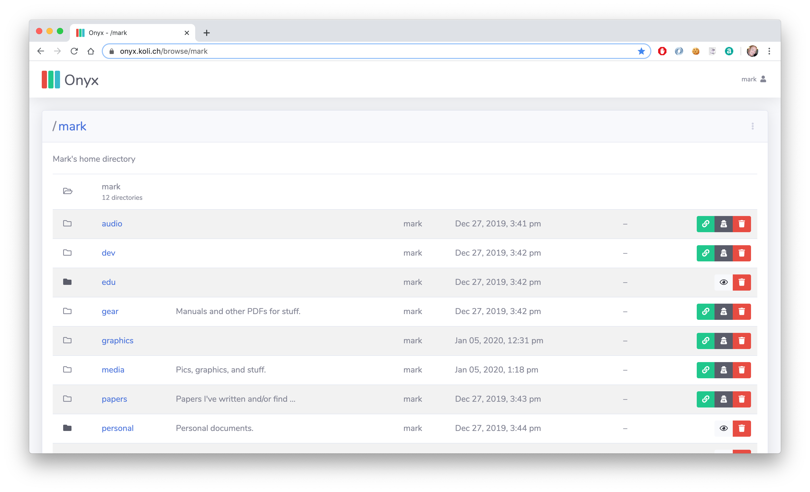
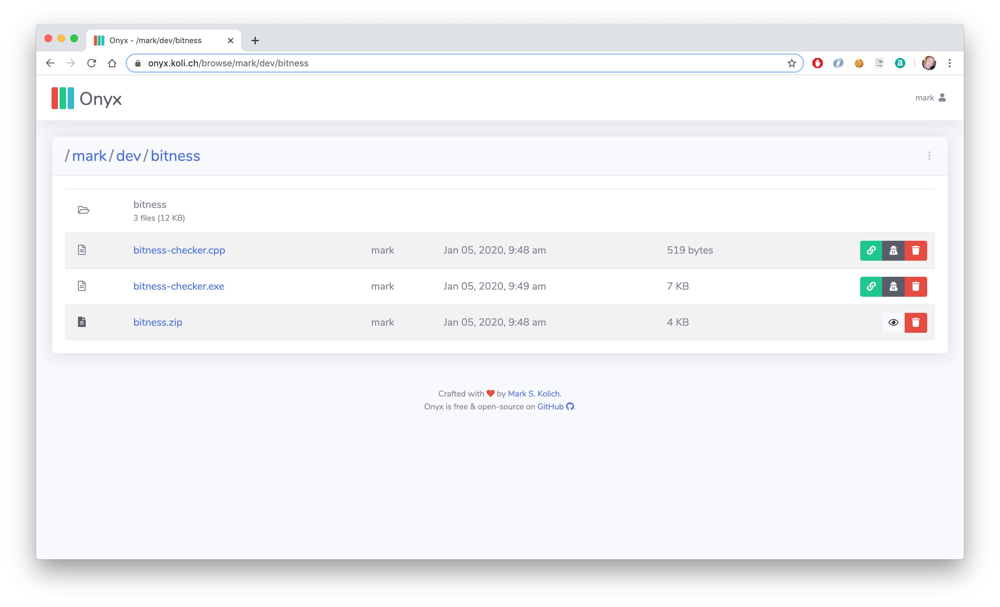
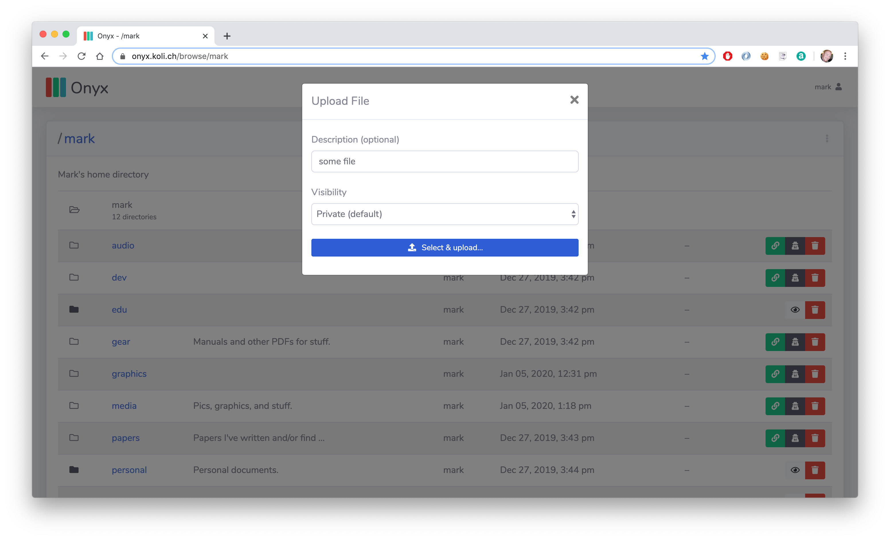
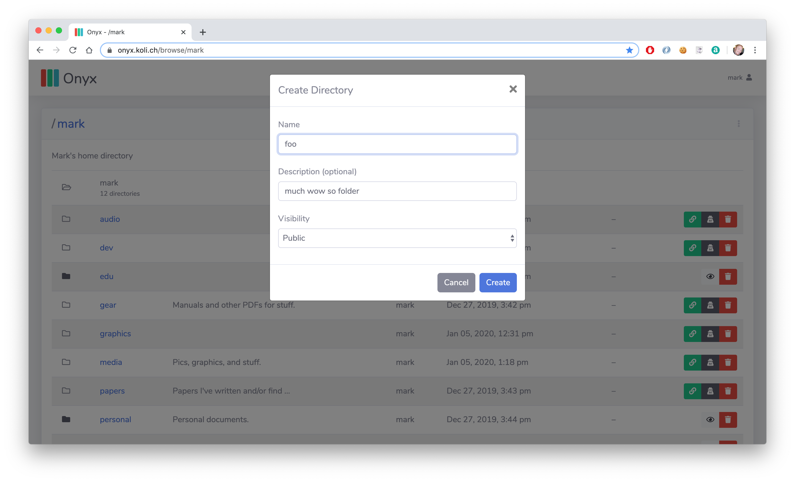

# onyx

Onyx is a simple web-interface for AWS S3. Internally, it stores files in AWS S3 and searchable object metadata in AWS DynamoDB.

It's built for Java 11, deploys from a single (fat/uber) JAR file, and runs beautifully on any box big or small.

With Onyx, the browser uploads files to AWS S3 &mdash; Onyx generates a pre-signed upload URL that allows authenticated users to `PUT` files directly to S3 within the browser. Similarly, file downloads are downloaded from AWS S3 &mdash; Onyx generates a pre-signed download URL that allows users to `GET` visible files directly from S3. Effectively, this means that file uploads and downloads are handled directly by AWS, not the web-server/host that runs Onyx.

This is advantageous for a number of reasons:

1. Bandwidth constraints: the web-server/host that is running Onyx doesn't process uploads or downloads, so you don't have to worry about a thundering-herd completely saturating your network. These file transfers are handled by AWS S3.
1. S3 bucket privacy: the S3 bucket in which Onyx stores binary objects (files) remains completely private, so users can only download files from S3 if Onyx allows them. Further, the download URLs are time-bombed, so every pre-signed download URL expires after some configurable amount of time. And, all files are encrypted at rest (as configured in the AWS Management Console).
1. Keep metadata in the cloud: Onyx relies on DynamoDB to store and manage all metadata about the files and directories for a given user. As a result, there are no local databases to run or manage.

## What it looks like

https://onyx.koli.ch









## Why?

Like many of us, I accumulated literally thousands of documents/files over decades of "life". Tax documents, financial records, medical records, manuals, code snippets, text pads, and family photos & videos we're sitting in several places spread over multiple personal devices: server, laptop, phone, etc. These life-critical documents and files I had accumulated were sitting in a poorly organized set of directories/folders on multiple devices.

I've been meaning to do something about this problem, and so I woke up one day and decided to consolidate my digital life.

To that end, I needed a platform that:

1. solves the "backup problem"
1. allows me to bring my own encryption keys for data at rest
1. enables me to publicly share specific files and directories
1. runs on a tiny [Raspberry Pi](https://www.raspberrypi.org/products/raspberry-pi-4-model-b/) in my data closet at home

As such, I sat down and built Onyx.

Oh sure, I could just have sucked it up and used any of the popular "cloud content management and file sharing services" already out there instead of rolling my own, but where's the fun in that!?

### The backup problem

Most of my life-critical files were sitting on a beefy 6TB RAID volume within an HP Proliant ML350 G5 server in my home office. I was fed up with administering this machine: the fan noise, the failed disks, the monthly electricity cost, etc. I just wanted to get rid of it and move the important content on it to "the cloud".

Not only is this net cheaper in the long run, but I now can now rely on AWS S3 (using my own encryption keys) to manage the redundant copies (backups) of these important files for me securely off-site.

### The trust problem

I wanted to build something I control end-to-end: something that I can trust. Meaning, a platform on which can manage the encryption keys used to encrypt files at rest in "the cloud" at AWS.

### The sharing problem

While much of my content is strictly private, there are a handful of files and directories I wanted to make public &mdash; this is content I want to publicly share with family, friends, and the internet at large.

As a result, Onyx has built-in support for private and public (sharable) files and directories. Once uploaded, users can mark a file or directory public, allowing others to see these resources while browsing Onyx. By comparision, any private file or directory remains hidden and is only visible to the resource owner with authentication.

### The hardware problem

I downsized and transitioned the web-sites and services I cared out to a fanless, solid-state Raspberry Pi. A tiny [RP4 Model B](https://www.raspberrypi.org/products/raspberry-pi-4-model-b/) completely replaced the noisy and expensive HP Proliant in my home office, and I was finally able to `shred` and `poweroff` the Proliant for good after uploading my content to Onyx.

## Bootstrap

This project is built and managed using Apache Maven.

To clone, build, and run this project you must have <a href="https://maven.apache.org">Maven installed and configured</a>.

To begin, clone the repository.

    #~> git clone https://github.com/markkolich/onyx.git

Run `mvn package` from within your newly cloned *onyx* directory to complete your first build build:

    #~> cd onyx
    #~/onyx> mvn package

The resulting runnable fat/uber JAR will be placed into the local *dist* directory.

### Configuration

Onyx is configured with HOCON using [lightbend/config](https://github.com/lightbend/config).

In development, you should create a `~/onyx-dev.conf` file with the following contents:

```hocon
include "application"

onyx {
  session {
    duration = 1d

    // LC_CTYPE=C tr -dc 'A-HJ-NPR-Za-km-z2-9' < /dev/urandom
    signer-secret = "[RANDOM SECRET STRING, USED TO SIGN SESSION COOKIES]"

    // Set to true if deployed behind Nginx with SSL
    https = false

    users = [
      {
        username = "[YOUR ONYX USERNAME HERE]"
        password = "$2a$12$.1VBtRRW.wKgE1iUoArKfuzHOyLTGe.7u6qmvV7bnSlXbvXDdPhga" // dev
      }
    ]
  }

  aws {
    access-key = "[YOUR AWS ACCESS KEY HERE]"
    secret-key = "[YOUR AWS SECRET KEY HERE]"
    region = "us-west-1"

    dynamo-db {
      table-name = "[YOUR DYNAMO DB TABLE NAME HERE]"
    }

    s3 {
      bucket-name = "[YOUR S3 BUCKET NAME HERE]"

      // Time bomb: how long any pre-signed download and pre-signed upload URLs
      // should remain valid once generated.
      asset-url-validity-duration = 5m
    }
  }
}
```

When running Onyx locally, specify your configuration file by passing a `-Dconfig.file` system property on the command line:

```
java -Dconfig.file=/path/to/your/onyx.conf -jar dist/onyx-0.1-runnable.jar
```

## Notes

Find all delete markers in an S3 bucket:

```
aws s3api list-object-versions \
  --bucket "bucket-name" \
  --output=json \
  --query='{Objects: DeleteMarkers[].{Key:Key,VersionId:VersionId}}'
```

Find and delete all delete markers in an S3 bucket (restoring the last noncurrent object to current):

```
aws s3api delete-objects --bucket "bucket-name" --delete "$(aws s3api list-object-versions \
  --bucket "bucket-name" \
  --output=json \
  --query='{Objects: DeleteMarkers[].{Key:Key,VersionId:VersionId}}')"
```

## Licensing

Copyright (c) 2026 <a href="https://mark.koli.ch">Mark S. Kolich</a>.

All code in this project is freely available for use and redistribution under the <a href="http://opensource.org/comment/991">MIT License</a>.

See <a href="https://github.com/markkolich/onyx/blob/master/LICENSE">LICENSE</a> for details.
